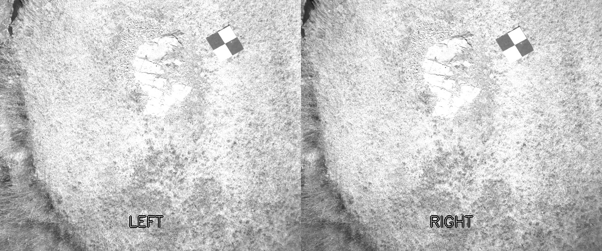
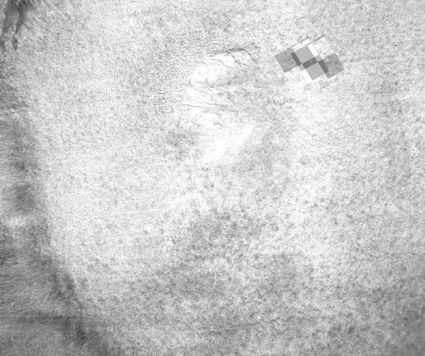
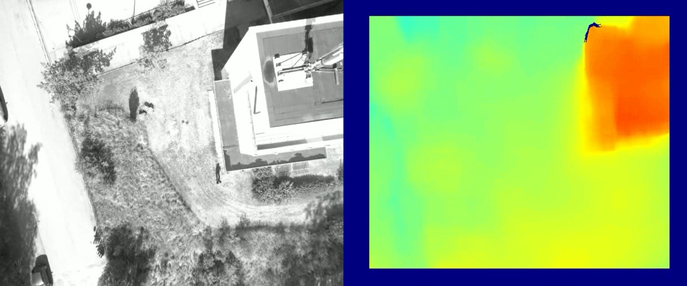
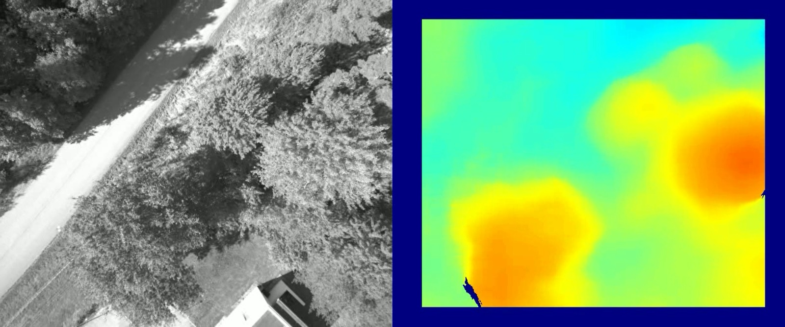

# stereo_vision
## Abstract
Stereo vision is a technique in image processing used for depth estimation, utilizing two calibrated cameras positioned at a fixed distance apart. This repository provides sample code for testing a stereo vision setup using OpenCV (CV2).

## Introduction
Stereo vision mimics human binocular vision, enabling depth perception by comparing the slightly different images received from each eye. Humans possess two eyes that allow them to gauge the depth of a scene. This capability arises from the fixed distance between the eyes, which capture images from different angles, resulting in a disparity between the images. The human brain interprets this disparity to understand depth, as images are essentially 2D representations of a 3D environment.

In a stereo vision system, two cameras are employed at a fixed distance. Because the images captured by each camera originate from slightly different angles, the positions of objects in each image differ slightly, creating what is known as disparity. Various matching methods, such as template matching, can be used to calculate this disparity. It can then be interpreted as distance using the following formula:
$$
Z=\frac{Bf}{d}
$$
where $Z$ represents the distance to the target object, $B$ is the baseline (the distance between the two cameras), $f$ is the focal length of the cameras, and $d$ is the disparity.

## Calibration
The calibration of the cameras plays a crucial role in stereo vision. Therefore, the quality of depth estimation is directly related to the quality of the calibration. The lenses of the cameras often cause distortion in the captured images. Additionally, the cameras need to be calibrated in relation to each other. The relative rotations of the cameras can be explained using a homography matrix, which can then be provided to the stereo vision algorithm.

To calibrate your stereo vision setup, I highly recommend visiting this repository: https://github.com/TemugeB/python_stereo_camera_calibrate. It provides an easy and automated calibration algorithm.

## An example
The following image shows the captured frames from a stereo vision setup taken simultaneously. Notably, the images appear to be identical.

The next image displays the combined frame from the left-side and right-side cameras. Here, the disparity in the checkered surface is visible.

This disparity is used to estimate the depth of the scene, which also provides the distance to the target object.

## Results
The following images are from the **FGI Masala Stereo-Visual-Inertial Dataset**, which is available [here](https://etsin.fairdata.fi/dataset/50c898c9-a8f9-4935-80f0-08fc661e88b3/data).

